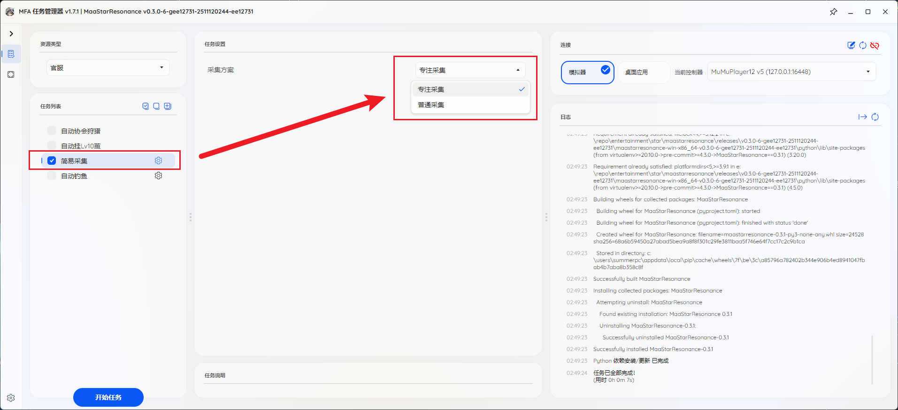
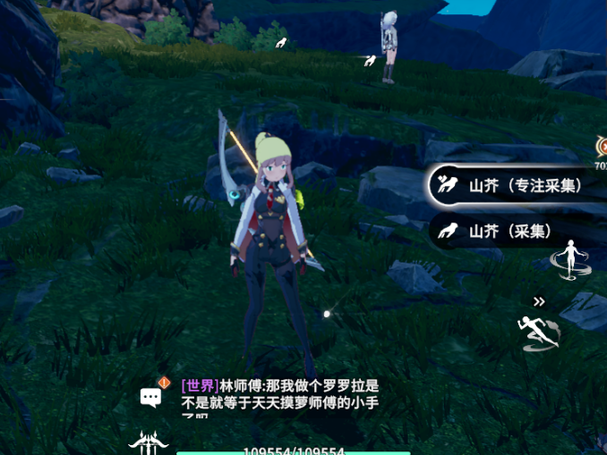

本模块为实现星痕共鸣自动完成简易采集

- [功能简介](#功能简介)
- [使用前提](#使用前提)
- [操作步骤](#操作步骤)
- [限制与注意事项](#限制与注意事项)

---

## 功能简介

简易采集用于在角色已经站在目标采集点附近时，快速执行固定点位的采集动作。

## 使用前提

- 角色已经移动到对应采集物附近
- 你已经在程序中连接到正确实例
- 你知道自己要选择哪一种采集方案

## 操作步骤

1. 先让角色站到目标采集物附近。
2. 在程序中打开 `简易采集`。
3. 在 `采集方案` 中选择需要的采集类型。
4. 点击 `开始任务`。

角色站位示例：

采集方案选择示例：

## 限制与注意事项

- 当前功能更接近定点采集，不负责长距离自动寻路
- 如果角色初始站位偏差较大，成功率会下降
- 开始前建议先手动确认采集物已经正常加载
