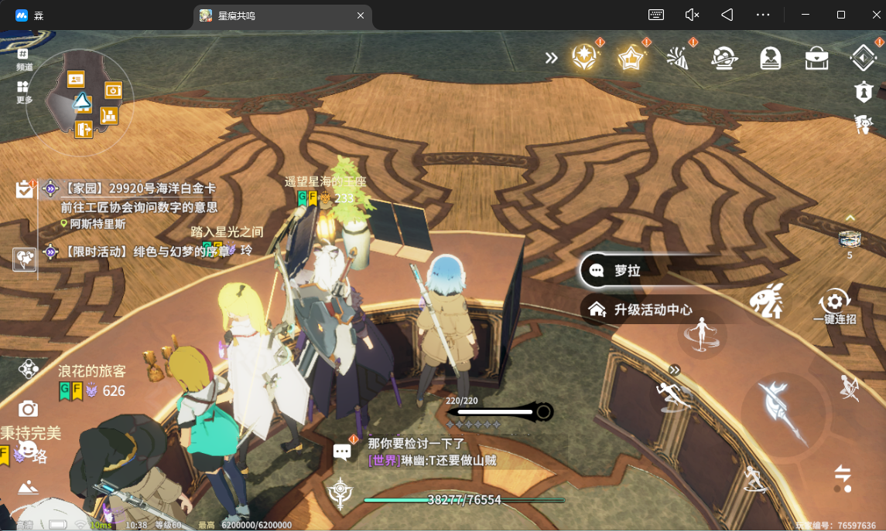
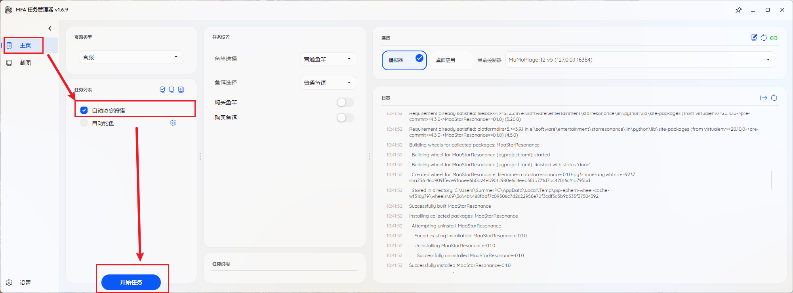
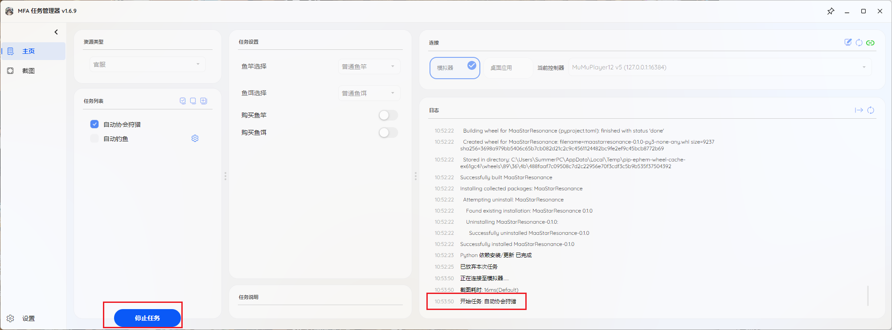
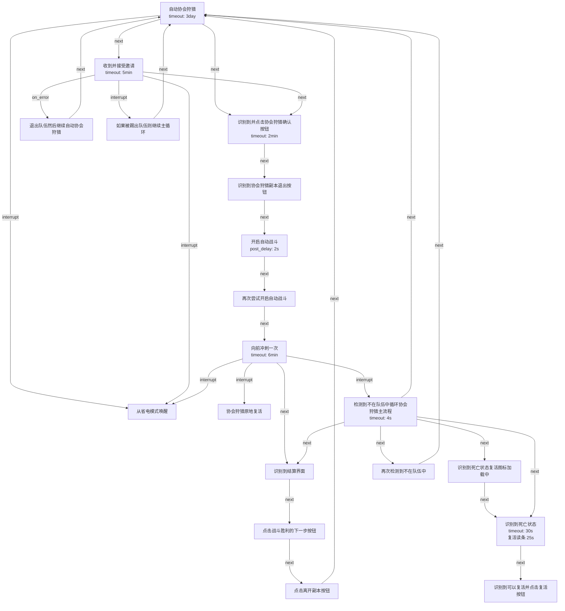

# 自动协会狩猎使用须知

## 功能简介

自动协会狩猎用于在账号待命时自动接受邀请、进入副本并执行基础战斗流程。

## 使用前提

- 你已经完成基础安装、连接和实例确认
- 角色已经准备在协会前台待命
- 相关成员知道哪些账号会参与自动协会狩猎

## 操作步骤

1. 先让角色在协会前台附近待命，方便队友识别该账号可用于自动狩猎。
2. 在主页勾选 `自动协会狩猎`。
3. 点击 `开始任务`，让账号进入待命循环。
4. 由其他成员邀请该账号参与协会狩猎。
5. 首次使用时，观察是否能正常自动战斗与自动复活。

待命位置示例：

启动任务示例：

停止任务示例：

## 限制与注意事项

- 模拟器加载较慢时，建议队友不要过早拉怪
- 尽量把战斗控制在进入狩猎后的起始半场附近，避免模型加载异常导致发呆
- 自动战斗对部分场景适应性有限，例如蜘蛛战斗体验较差
- 狩猎完成后请及时把自动账号移出队伍

## 给队友的协作提醒

- 约定哪些账号属于自动狩猎账号
- 邀请后确认账号已成功入队
- 如果决定不打蜘蛛，请务必在狩猎局内将自动账号移出队伍
- 特殊战斗场景下，按实际情况决定是否继续带自动账号

## 任务流程概览

