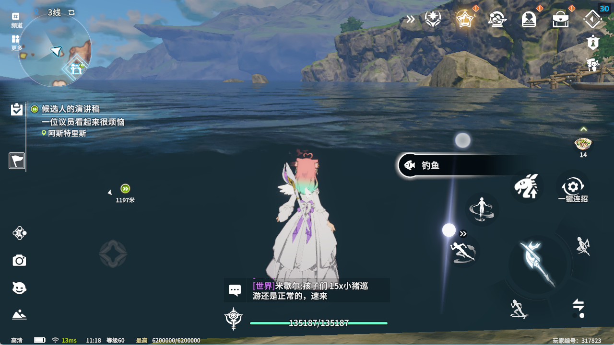
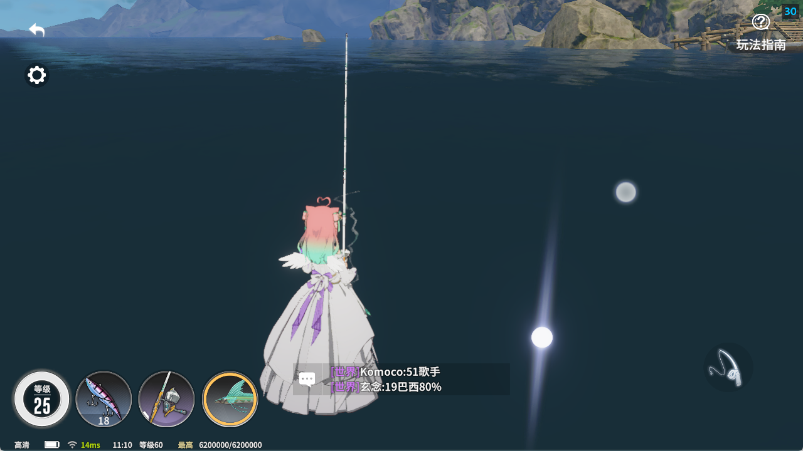
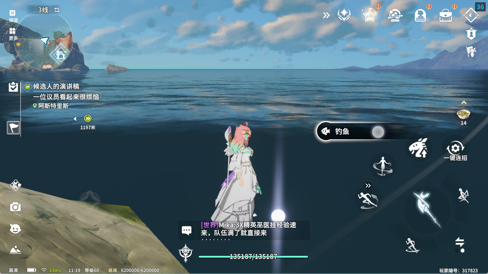
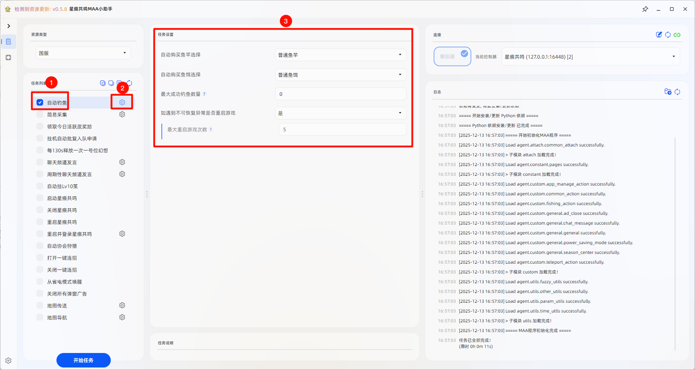
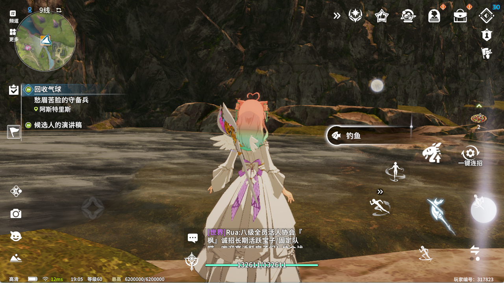
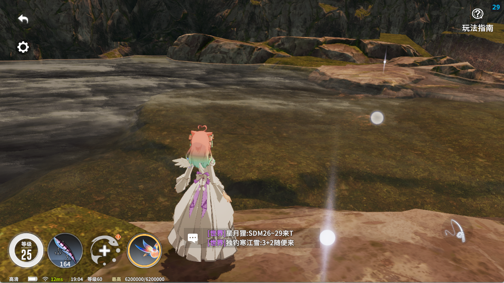
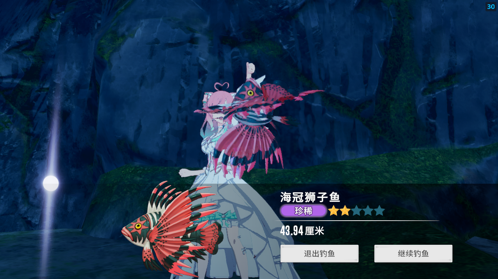
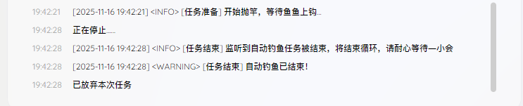

# 自动钓鱼使用须知

## 功能简介

自动钓鱼用于在合适钓鱼点持续执行钓鱼流程，并在配置不足时自动补充鱼竿和鱼饵。

## 使用前提

- 你已经完成基础安装与连接
- 你已经找到一个适合脚本挂机的钓鱼点
- 你知道当前账号的登录状态有效

## 钓鱼点选择

建议选择满足以下条件的钓鱼点：进入钓鱼后再退出，界面右侧仍然能看到 `钓鱼` 按钮。
这类点位更适合长时间循环，稳定性也更高。

1. 进入钓鱼点前

   

2. 进入钓鱼点后

   

3. 退出钓鱼点后

   

## 操作步骤

1. 先确认钓鱼点满足上面的条件。
2. 在程序主页勾选 `自动钓鱼`。
3. 根据需要设置自动购买的鱼竿和鱼饵。
4. 点击 `开始任务`。

程序配置界面示例：

常见的可启动界面示例：

## 结束任务

需要停止时，在程序界面点击 `结束任务` 即可。
当右下角日志出现 `[任务结束] 自动钓鱼已结束！` 时，说明任务已经正常结束，建议此时再操作设备。

## 限制与注意事项

- 钓鱼点选择不合适时，循环稳定性会明显下降
- 服务器热重启、月卡弹窗、省电模式会尝试自动处理，但仍建议先观察首次运行
- 遇到无法恢复的异常时，脚本可能会尝试重启游戏

## 特别鸣谢

本程序使用的部分静态资源来自 [Particle_G](https://github.com/ParticleG)
开发的 [maa-star-resonance](https://github.com/26F-Studio/maa-star-resonance)，非常感谢。
