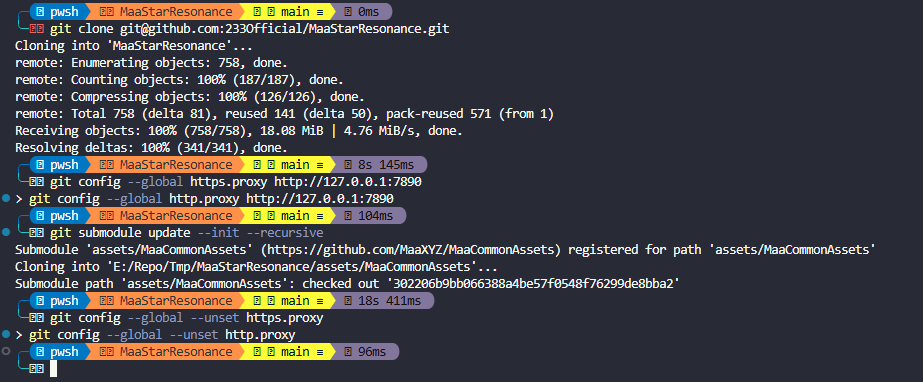
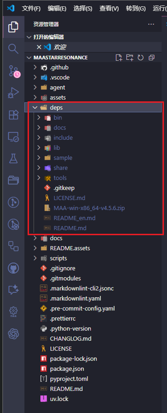
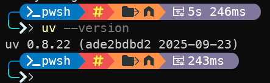
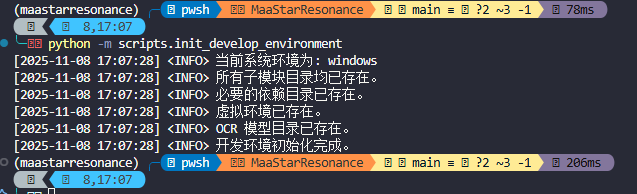
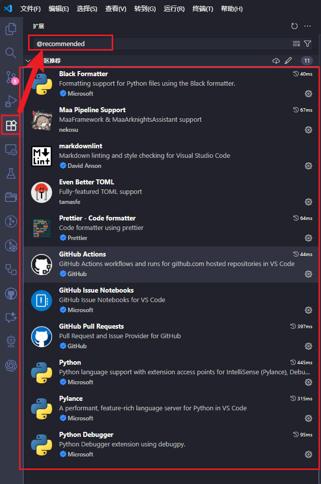
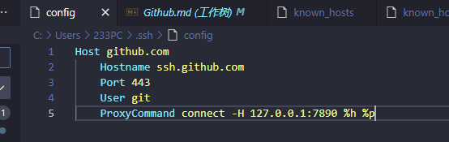

# 快速开始

> 本页只负责开发环境准备和首次贡献流程。
>
> 如果你还不知道该看哪份开发文档，请先看 [开发者文档入口](/docs/开发者文档/开发者文档入口)。
>
> 普通使用者请转到 [新手指南](/docs/新手指南/新手指南入口)。

## 适用对象

- 想在本地运行 MaaStarResonance 的开发者。
- 想提交代码或文档 PR 的贡献者。

## 你将完成什么

- Fork 和 clone 仓库。
- 初始化 Python 与 Node 相关环境。
- 跑通项目依赖与基础开发工具。

## 前置环境

- Python `>=3.11`，推荐 `3.13`。
- Node.js `>=20`。
- Git。
- Windows 环境下建议配合 VSCode 开发。

## 主流程

1. Fork [MaaStarResonance 主仓库](https://github.com/AsterleedsGuild0/MaaStarResonance)，然后使用 `git clone --recursive` 克隆你自己的仓库。

   ```bash
   # https clone
   git clone --recursive https://github.com/<你的用户名>/MaaStarResonance.git
   # ssh clone
   git clone --recursive git@github.com:<你的用户名>/MaaStarResonance.git
   ```

   如果你已经克隆过仓库但没初始化子模块，请执行：

   ```bash
   git submodule update --init --recursive
   ```

   

2. 下载 MaaFramework 的 [Release 包](https://github.com/MaaXYZ/MaaFramework/releases)，解压到仓库根目录的 `deps` 文件夹。

   

3. 安装 `uv` 并同步 Python 依赖。

   ```bash
   # Windows
   powershell -ExecutionPolicy ByPass -c "irm https://astral.sh/uv/install.ps1 | iex"
   # macOS/Linux
   curl -LsSf https://astral.sh/uv/install.sh | sh
   # 验证安装
   uv --version
   # 同步依赖
   uv sync
   ```

   

4. 运行项目提供的初始化脚本，检查并补齐开发环境。

   ```bash
   uv run scripts/init_develop_environment.py
   ```

   

5. 使用 VSCode 打开仓库，并安装推荐扩展。

   

6. 完成以上步骤后，就可以开始修改文档、资源或代码。

## 验证方式

完成环境初始化后，至少运行下面两项检查：

1. `uv run scripts/init_develop_environment.py` 能正常执行完毕。
2. 根据你修改的内容运行对应检查，例如：
   - 文档修改：`npm run docs:check`
   - 提交前总检查：`pre-commit run --all-files`

## Github Pull Request 流程简述

### 我不懂编程，只是想改一点点 JSON 文件或文档，要怎么操作？

欢迎先阅读 [牛牛也能看懂的 GitHub Pull Request 使用指南](https://maa.plus/docs/zh-cn/develop/pr-tutorial.html)。

### 我有编程经验，但是没参与过相关项目，要怎么做？

1. 在自己的 fork 仓库中创建一个新分支，不要直接在 `main` 上开发。
2. 在本地完成修改后，使用 `git add` 和 `git commit -m "message"` 提交。
3. 推送分支到你的 fork 仓库。

   ```bash
   git push origin <branch-name>
   ```

4. 在 GitHub 上发起 Pull Request，等待维护者审核。

如果主仓库出现了新的提交，你通常还需要同步更新：

```bash
git remote add upstream https://github.com/AsterleedsGuild0/MaaStarResonance.git
git fetch upstream
git rebase upstream/main
```

## 可选参考

### Git 代理配置

如果 `https clone` 较慢，可以临时配置代理：

```bash
git config --global https.proxy http://127.0.0.1:7890
git config --global http.proxy http://127.0.0.1:7890
```

完成后可按需取消：

```bash
git config --global --unset https.proxy
git config --global --unset http.proxy
```

如果你使用 `ssh clone`，也可以配置 `~/.ssh/config`：



### 代码格式化工具

项目当前使用的主要格式化工具如下：

| 文件类型 | 格式化工具 |
| --- | --- |
| JSON/YAML | [prettier](https://prettier.io/) |
| Markdown | [markdownlint-cli2](https://github.com/DavidAnson/markdownlint-cli2) |

如果你希望在提交前自动执行这些检查，可以安装 pre-commit：

```bash
pip install pre-commit
pre-commit install
```

手动触发所有检查：

```bash
pre-commit run --all-files
```

### 额外调试工具

| 工具 | 简介 |
| --- | --- |
| [MaaDebugger](https://github.com/MaaXYZ/MaaDebugger) | 独立调试工具。 |
| [Maa Pipeline Support](https://marketplace.visualstudio.com/items?itemName=nekosu.maa-support) | VSCode 插件，提供调试、截图、ROI、取色等功能。 |
| [MFA Tools(仅 Win)](https://github.com/SweetSmellFox/MFATools) | 独立截图、获取 ROI 及取色工具。 |

### 参考资料

- [MaaFW 的文档](https://maafw.xyz/docs)：了解 MaaFramework 的工作原理与配置。
- [M9A 的开发者文档](https://1999.fan/zh_cn/develop/development.html)：优秀实践参考。
- [M9A 的 GitHub 仓库](https://github.com/MAA1999/M9A)：可参考相似场景实现。
- [learnGitBranching](https://github.com/pcottle/learnGitBranching)：可视化 Git 学习工具。
- [git 官方文档](https://git-scm.com/docs)。
