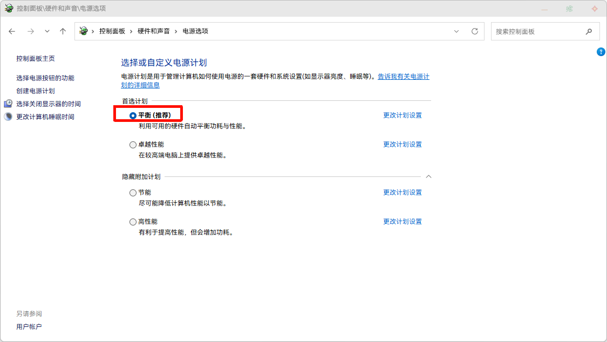

# AMD调优

## AMD 的 CPU

控制面板\系统和安全\电源选项，务必使用 **平衡** 模式，Win11下安装AMD的`Chipset芯片组`后，对平衡模式有特调逻辑，调完记得 **重启电脑**

## AMD 的 显卡（可选）

> - 性能-调整：使用默认配置文件
> - 游戏-显卡：
>   - Radeon Anti-Lag: 启用
>   - 图片锐化（Image Sharpening）：启用
>   - 清晰度：80%
>   - 各向异性过滤：启用
>   - 各向异性过滤级别：8x
>   - 纹理过滤质量：高/标准均可
>   - 表面格式优化：启用
>   - 镶嵌模式：覆盖应用程序设置
>   - 最大镶嵌级别：关
