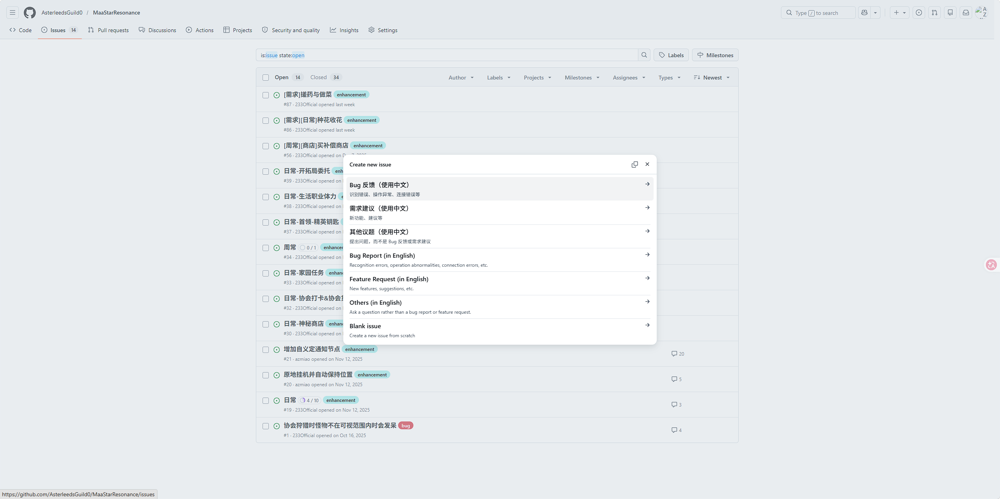

## 启动很慢正常吗

首次启动或更新后，依赖初始化会比较慢，通常属于正常现象。

## 为什么连接不到正确实例

多开时通常需要根据 adb 端口手动选择实例，并通过 `截图` 页面再次确认账号。

## 为什么识别效果异常

最常见原因是分辨率、横屏状态或画质配置不符合推荐环境。

## 为什么运行异常不在支持范围内

如果当前环境不满足推荐分辨率，或使用了明显偏离文档建议的画质组合，出现异常通常不在支持范围内。

## AMD 的 CPU 或者 显卡 渲染模拟器帧率很低

可参考：[AMD调优](./AMD调优.md)

## 文档没覆盖我的情况怎么办

请前往 GitHub Issue 反馈，并尽量附上界面截图和你的环境信息。

[点击前往提交 Issue](https://github.com/AsterleedsGuild0/MaaStarResonance/issues)

