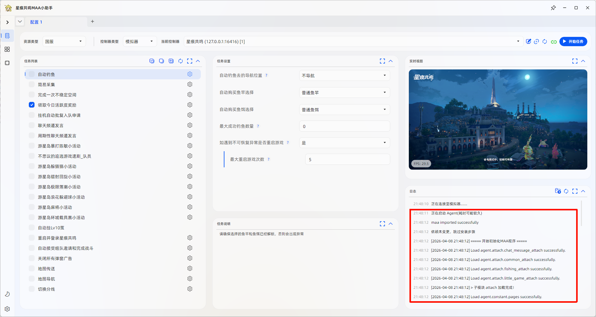
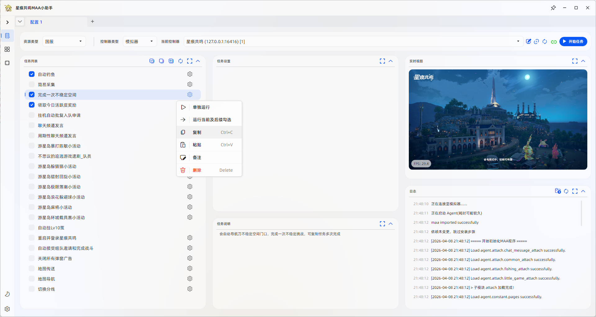

# 开始任务

## 这篇文档解决什么问题

这篇文档负责帮助你完成第一次实际执行，确认程序已经可以正常跑通基础任务。

## 第一次建议怎么跑

1. 等待程序完成 Python Agent 启动和依赖检查。
2. 回到主页，勾选一组你最容易验证的任务。
3. 点击 `开始任务`。
4. 先观察任务能否进入正常执行，再继续配置其他功能。

## 使用建议

- 可以在左侧任务列表中勾选多个任务，程序会按顺序执行
- 如果你需要重复执行某个任务，可以复制该任务后组合使用

## 跑通之后看什么

- 想继续了解具体功能限制：看 [功能文档](/docs/功能文档/功能文档入口)
- 想回头检查连接是否正确：看 [连接程序与确认实例](./连接程序与确认实例.md)
- 想排查首次使用中的常见异常：看 [常见问题](./常见问题.md)
