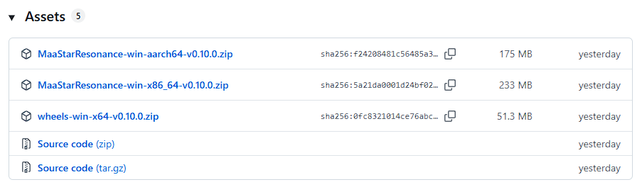
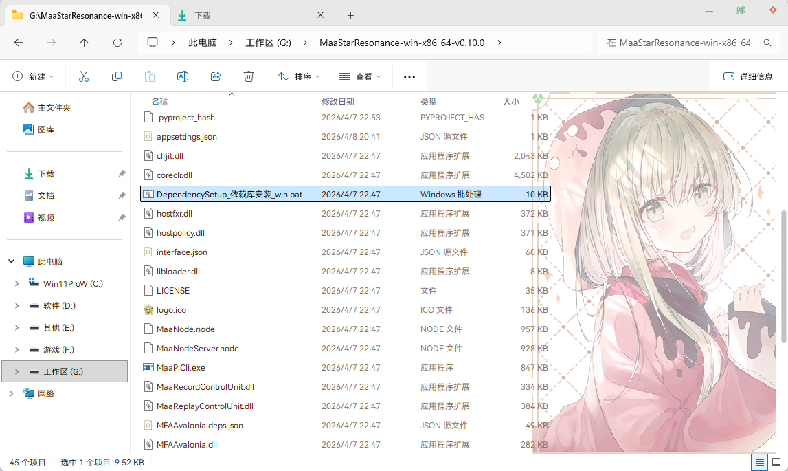

# 环境准备

## 这篇文档解决什么问题

这篇文档负责帮助你完成下载、解压、依赖安装，以及首次启动前的基础准备。

## 第一步：下载程序

1. 打开项目 [Release 页面](https://github.com/AsterleedsGuild0/MaaStarResonance/releases)
2. 在最新版本的 `Assets` 分类中下载中适合你设备的压缩包：`MaaStarResonance-win-x86_64.zip` 或 `MaaStarResonance-win-aarch64.zip`。
3. 将压缩包解压到一个你方便管理的目录。

## 第二步：安装依赖

1. 进入解压后的目录。
2. 找到 `DependencySetup_依赖库安装_win.bat`。
3. 右键 `以管理员身份运行` ，等待脚本自动检查并安装缺失依赖。

## 第三步：了解首次启动会发生什么

- 首次启动程序时，可能还会进行 `Python Agent` 初始化和依赖检查。
- 这个过程通常需要等待一段时间才可使用功能，属于正常现象。
- 这些安装和更新默认发生在当前 MaaStarResonance 目录内，不会改动系统全局 Python 环境。

## 开始前确认

- 你已经成功解压程序
- 你已经运行依赖安装脚本
- 你知道下一步需要继续看 [模拟器配置](./模拟器配置.md)
