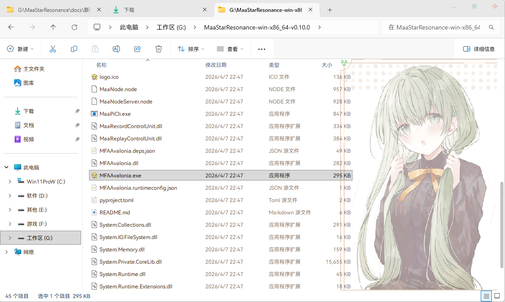
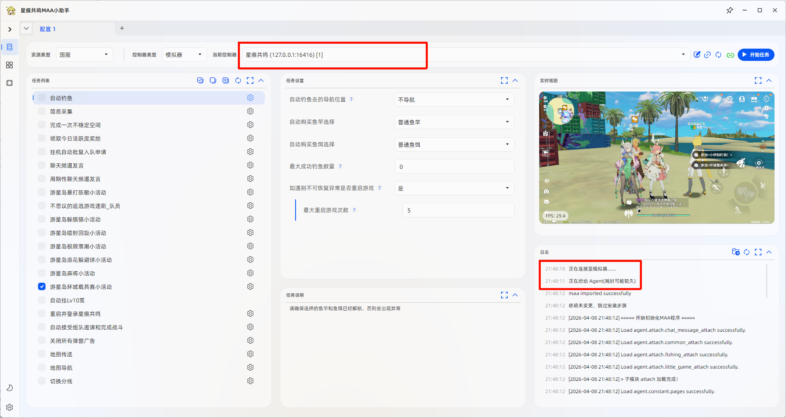
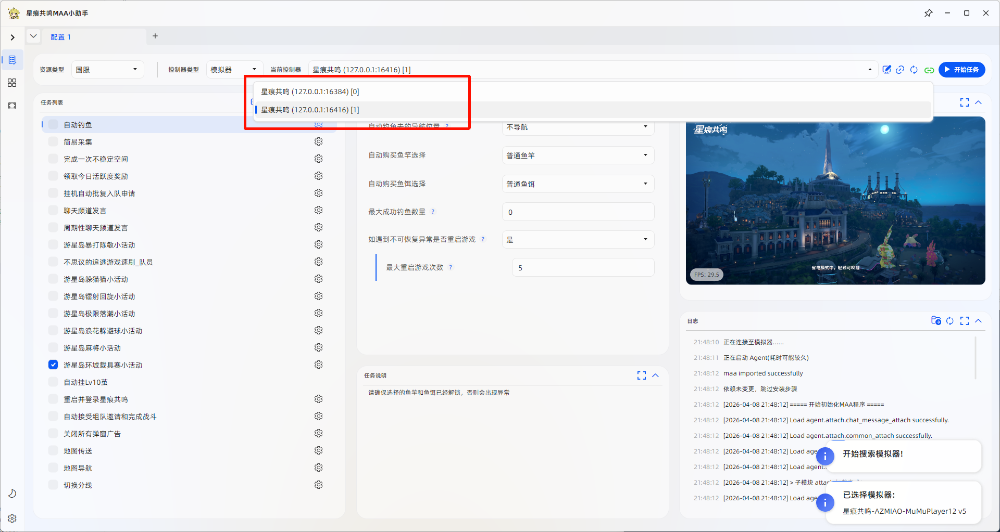
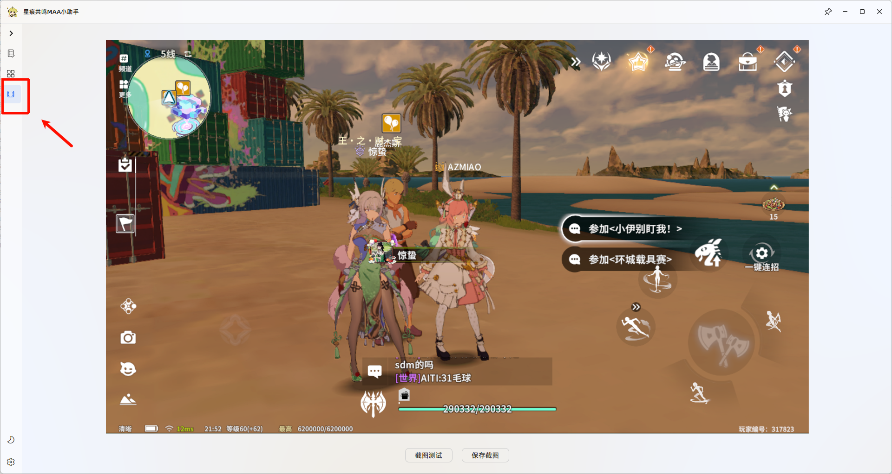

# 连接程序与确认实例

## 这篇文档解决什么问题

这篇文档负责帮助你启动程序、连接到正确的模拟器实例，并在多开场景下确认没有连错账号。

## 启动程序并连接模拟器

1. 运行 `MFAAvalonia.exe`。
2. 如果只开了一个模拟器，程序通常会自动连接。
3. 如果开了多个模拟器，请在下拉列表中选择目标实例。
4. 切换到左侧的 `截图` 页面，确认当前连接的是目标账号。

## 多开时如何确认对应模拟器

如图位置点击进行截图测试即可确认所连接的模拟器

## 完成后做什么

如果你已经确认连接到正确实例，下一步请看 [开始任务](./开始任务.md)。
